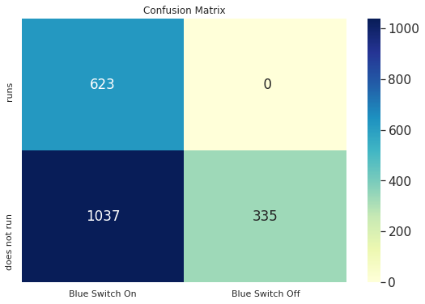
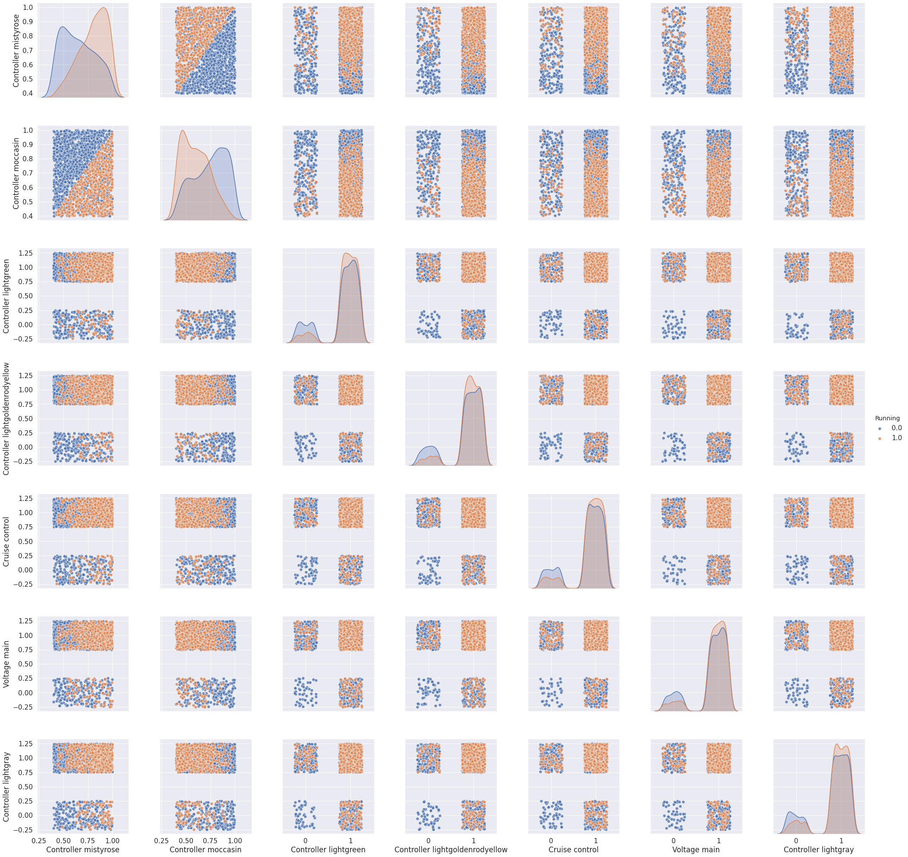
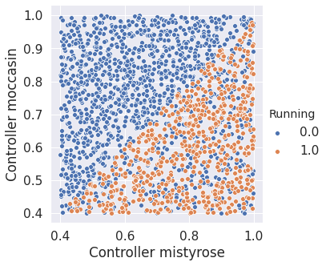
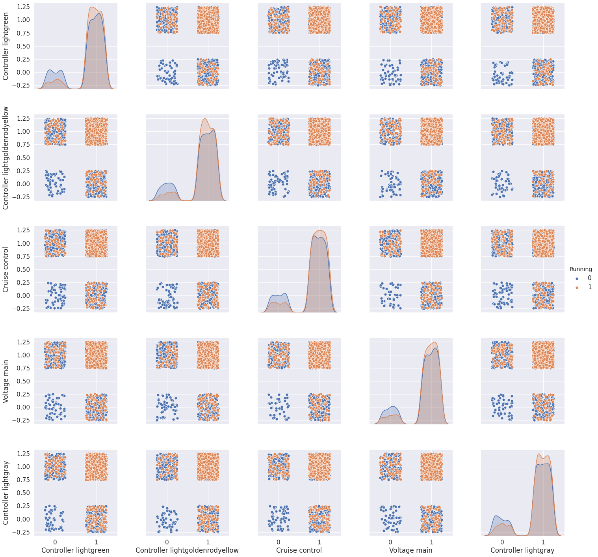
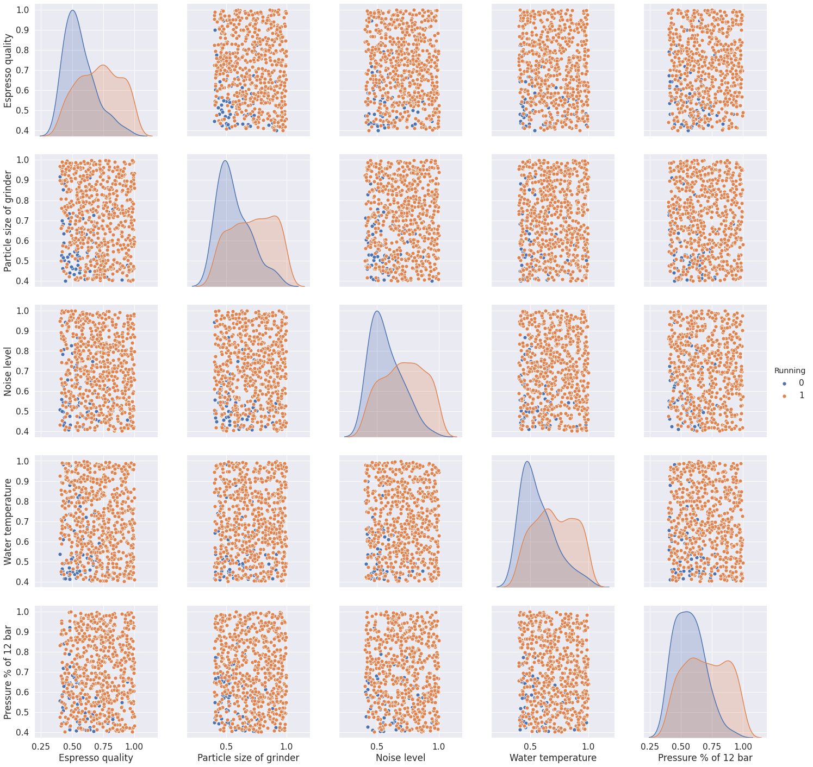
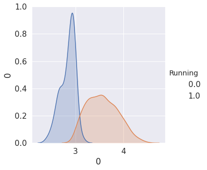

# The Mysterious Machine #

### >>> We won this challenge along with 2 other groups that had a similar same solution. 

Please form groups of three.

Send your results via email to Philipp.Petersen@univie.ac.at. One email per Team.

Deadline: 16.04. 18:00.

All submissions after 18:00 + 1 second will be ignored.

The best submission, the second best submission, and the most creative submission will receive a price.

You can use any coding language you want, but I recommend to you use the supplied jupyter notebook. 
You'll find guidelines on how to set up python on your machine on the internet. For the jupyter notebook for example here: https://test-jupyter.readthedocs.io/en/latest/install.html.

```python
import numpy as np
import matplotlib as mpl
import matplotlib.pyplot as plt
import pandas as pd
import seaborn as sn
from IPython.display import display
%matplotlib inline
```

# Importing  and cleaning the data set


```python
data_train_db = pd.read_csv('data_train_db.csv')
data_test_db = pd.read_csv('data_test_db.csv')
```


```python
#It seems like there are some data points which have much higher standard deviation than most. Lets just remove those.
def clean_dataset(data):
    to_drop= []
    for k in range(data.shape[0]):
        if data[k,:].std()>12:
            to_drop.append(k)   
    return np.delete(data, to_drop, axis = 0)
 
data_train = data_train_db.values
columns=data_train_db.columns

data_train = clean_dataset(data_train)
df_train=pd.DataFrame(data_train,columns=columns)
```

# Looking for patterns in the data set


```python
runs_switchon = np.count_nonzero((data_train[:,0]==1)*(data_train[:,1]==1))
runs_switchoff = np.count_nonzero((data_train[:,0]==1)*(data_train[:,1]==0))
runsnot_switchon = np.count_nonzero((data_train[:,0]==0)*(data_train[:,1]==1))
runsnot_switchoff = np.count_nonzero((data_train[:,0]==0)*(data_train[:,1]==0))
conf_matrix = [[runs_switchon, runs_switchoff], [runsnot_switchon, runsnot_switchoff]]

sn.set(color_codes=True)
plt.figure(1, figsize=(9, 6))

plt.title("Confusion Matrix")

sn.set(font_scale=1.4)
ax = sn.heatmap(conf_matrix, annot=True, cmap="YlGnBu",fmt='2')

ax.set_yticklabels(['runs', 'does not run'])
ax.set_xticklabels(['Blue Switch On', 'Blue Switch Off'])
plt.show()

```





Hence if the **Blue Switch On** is off=0 the machine does not run.


 
Next we look at variable witch are highly (positively or negatively) corrolated (pearson) with "Running" for easily spotted deppendencies:


```python
#S is the list of variables sorted by how highly (positively or negatively) corrolated they are with "Running" 
s = np.argsort(np.abs(np.array(df_train.corr()['Running'])))[::-1]
S=columns[s]

#Since we already know how "Running" and "Blue Switch On" corrolate with "Running" we delete those
S = S.drop(["Running","Blue Switch On"])
```

Since some of the variables are binary scatterplots will only be informative if we add some sort of jitter:


```python
df_train_jitter=df_train.copy()
#CB is a list of binary variables
CB=[c for c in columns if len(np.unique(df_train[c]))<20] 
CB=CB[2:]#We ignore the "Running" and "Blue Swich On"
for c in CB:
    df_train_jitter[c]+=np.random.uniform(-1/4,1/4,len(df_train_jitter))
```

Now we plot the plot the interaction of the variables most correlated with "Running"


```python
A=sn.pairplot(df_train_jitter,y_vars=S[0:7],x_vars=S[0:7],hue="Running",plot_kws={"s":50,'alpha':0.8},height=4)
plt.show()
```





We spot two things:

1) If **Controller moccasin > Controller mistyrose** the machine does not work.


```python
sn.pairplot(df_train,y_vars="Controller moccasin",x_vars="Controller mistyrose",hue="Running",plot_kws={"s": 35},height=5)
plt.show()
```





```python
errors=0
for i in range(1000):
    if df_train["Controller mistyrose"][i]<=df_train["Controller moccasin"][i] and df_train["Running"][i]==1:
        errors+=1
print("When we test this assumtion we get", errors, "errors :)")
```

    When we test this assumtion we get 0 errors :)


2) The second thing we notice is that in the graphic below there are never any orange points in the lower left squares, hence we assume that if at least **two of the plotted variables are 0** the machine does not run. 


```python
A=sn.pairplot(df_train_jitter,y_vars=S[2:7],x_vars=S[2:7],hue="Running",plot_kws={"s": 50,'alpha':1},height=4,hue_order=[0,1])
plt.show()
```





```python
errors=0
for i in range(len(df_train)):
    if np.sum(df_train[S[2:7]],axis=1)[i]<=3:
        if df_train['Running'][i]:
            errors+=1
print("When we test this assumtion we get", errors, "errors :)")
```

    When we test this assumtion we get 0 errors :)


# Filter out cases where the result has already been determined

Lets filter out the cases where the **Blue Switch On=0**, **Controller moccasin > Controller mistyrose** or **two of the above varibles are 0 at the same time** since we already know that the machine will not run in these cases


```python
df_train0 = df_train[df_train["Blue Switch On"]!=0]
df_train1 = df_train0[df_train0["Controller moccasin"]<df_train0["Controller mistyrose"]]
df_train2 = df_train1[np.sum(df_train1[['Controller lightgreen', 'Controller lightgoldenrodyellow','Cruise control', 'Voltage main', 'Controller lightgray']],axis=1)>3]
```

Lets check how many times the machine runs or not runs in our filtered dataset


```python
np.unique(df_train2["Running"],return_counts=True)
```


    (array([0., 1.]), array([ 68, 623]))


Wow only 68 fails cases not accounted for!

Lets repeat the previous procedure:

# Looking for  patterns in the remaining data set


```python
#S is the list of variables sorted by how highly (positively or negatively) corrolated they are with "Running" 
s = np.argsort(np.abs(np.array(df_train2.corr()['Running'])))[::-1]
S=columns[s]

#We delete "Running", "Blue Swich On" and the other binarie variables we already used
S = S.drop(['Running','Blue Switch On','Controller mistyrose', 'Controller moccasin', 'Controller lightgreen','Controller lightgoldenrodyellow', 'Cruise control'])

```


```python
A=sn.pairplot(df_train2,y_vars=S[:5],x_vars=S[:5],hue="Running",plot_kws={"s": 50},height=4,hue_order=[0,1])
plt.show()
```





None of these are great classifiers but we suspect that the sum might be


```python
df_train2_sum=pd.concat([df_train2["Running"],np.sum(df_train2[['Espresso quality', 'Particle size of grinder', 'Noise level','Water temperature', 'Pressure % of 12 bar']],axis=1)],axis=1)

sn.pairplot(df_train2_sum,y_vars=0,x_vars=0,hue="Running",plot_kws={"s": 35},height=5)
plt.show()
```





3.0 looks like a good threshhold (it's better then it looks since the plot smoothes out the curves)

Lets look at how it holds up:


```python
errors=0
for i in range(len(df_train2)):
    if np.array(np.sum(df_train2[['Espresso quality', 'Particle size of grinder', 'Noise level','Water temperature', 'Pressure % of 12 bar']],axis=1))[i]<3:
        if np.array(df_train2['Running'])[i]:
            #print("False Negative")
            errors+=1
    else:
        if not np.array(df_train2['Running'])[i]:
            #print("False Positive")
            errors+=1
print("When we test this assumtion we get", errors, "errors :)")
```

    When we test this assumtion we get 2 errors :)


This looks great choosing 3 as a threshold gives a classifier that only makes 2 mistakes when classifing the remaining 691 samples

Let's formulate this classifier as a function:


```python
def mycls(data,p=False):
    #determine if x is an outlier but maybee also useless since in the test set all outliers are also mapped to not Running which makes somewhat sense
    
    #check if "Blue Switch On"==1
    if data["Blue Switch On"]==0:
        if p:
            print("Blue Switch On")
        return 0
    
    #check if Controller moccasin > Controller mistyrose
    if data["Controller moccasin"] > data["Controller mistyrose"]:
        if p:
            print("Controller moccasin > Controller mistyrose")
        return 0

    #check  two of the varibles ['Controller lightgreen', 'Controller lightgoldenrodyellow',
    #'Cruise control', 'Voltage main', 'Controller lightgray'] are 0 at the same time
    if np.sum(data[['Controller lightgreen', 'Controller lightgoldenrodyellow','Cruise control', 'Voltage main', 'Controller lightgray']])<=3:
        if p:
            print("two varibles are 0 at the same time")
        return 0
    
    
    #check if sum(['Espresso quality', 'Particle size of grinder', 'Noise level',
    #              'Water temperature', 'Pressure % of 12 bar'])>3
    if np.sum(data[['Espresso quality', 'Particle size of grinder', 'Noise level', 'Water temperature', 'Pressure % of 12 bar']])<3:
        if p:
            print("np.sum(data[['Espresso quality', 'Particle size of grinder', 'Noise level','Water temperature', 'Pressure % of 12 bar']])<3")
        return 0

    return 1    
```


```python
err=0
for x in df_train.T:
    if  df_train.T[x]['Running']!=mycls(df_train.T[x]):
        err+=1
print(err)
```

    2


```python
#These are the indices of the used variables
c=[0,1,70,71,72,73,74,80,81,82,83,84,98,99]
```

# Looking at Outliers:


```python
def problems_dataset(data):
    to_drop= []
    for k in range(data.shape[0]):
        if data[k,:].std()>12:
            to_drop.append(k)   
    return to_drop# np.delete(data, to_drop, axis = 0)

```


```python
problemtrain=problems_dataset(np.array(data_train_db))
problemtest=problems_dataset(np.array(data_test_db))
problemtrain,problemtest
```


    ([17, 372, 644, 881, 928], [168, 190, 216, 229, 253, 262, 461, 462, 475, 491])


```python
qwertz=pd.DataFrame(np.array(data_train_db)[problemtrain],columns=columns)
qwertz["Running"]
```


    0    0.0
    1    0.0
    2    0.0
    3    0.0
    4    0.0
    Name: Running, dtype: float64


This could let us assume that the machine does not run for outliers, especially since the classifier "mycls" gives a false positve on the sample:


```python
for x in qwertz.T:
    print(mycls(qwertz.T[x]),end=", ")
```

    0, 0, 0, 1, 0, 

But since "mycls" classifies all outliers in the testset as not running anyhow, we will not have to code that assumtion into the classifier:


```python
for x in problemtest:
    print(mycls(data_test_db.T[x]),end=", ")
```

    0, 0, 0, 0, 0, 0, 0, 0, 0, 0, 
